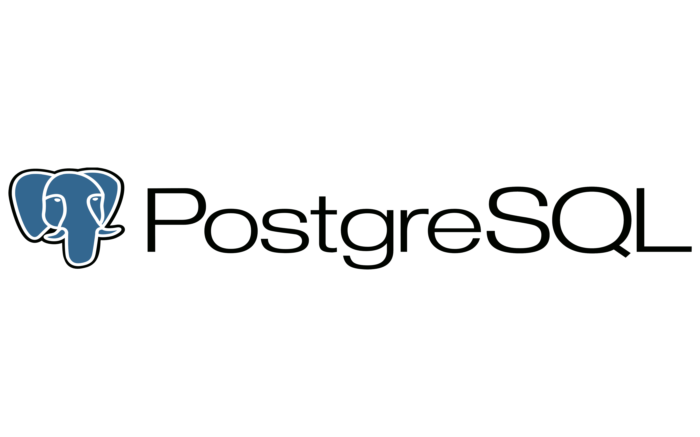

# Simple Bank

## a go/docker/postgres project to implement a simple bank server

It will provide APIs for the frontend to do following things:
* Create and manage bank accounts, which are composed of owner’s name, balance, and currency.
* Record all balance changes to each of the account. So every time some money is added to or subtracted from the account, an account entry record will be created.
* Perform a money transfer between 2 accounts. This should happen within a transaction, so that either both accounts’ balance are updated successfully or none of them are.

## Setup local development
### install tool
* Docker

    `sudo apt-get update sudo apt-get install docker-ce docker-ce-cli containerd.io`
* [TablePuls](https://tableplus.com/linux)
* Migrate

    `curl -L https://github.com/golang-migrate/migrate/releases/download/$version/migrate.$platform-amd64.tar.gz | tar xvz
    `
* Sqlc 

    `go install github.com/kyleconroy/sqlc/cmd/sqlc@latest`
* Gomock

    `go install github.com/golang/mock/mockgen@v1.6.0`
* Viper 
* Viper 

    `go get github.com/spf13/viper`

## Setup infrastructure
    reference Makefile

* Build docker compose

    `reference docker-compose`

* Unit test with GitHub Action

    `reference .github/workflow test.yml`

* Push image to Alibaba Cloud Container Registry

    `reference .GitHub/workflow deploy.yml`

## How to generate code
* Generate schema SQL file with DBML:

    `make db_schema`
* Generate SQL CRUD with sqlc:

    `make sqlc`
* Generate DB mock with gomock:

    `make mock`
* Create a new db migration:

    `migrate create -ext sql -dir db/migration -seq <migration_name>`
## How to run
* Run server:

    `make run`
* Run test

    `make test`